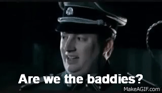

## Am I the Baddie: A Stakeholder Reflective

The key takeaway I have from the cases we've read this semester can be summarized in a singular statement: **sometimes we are very bad at being good.**

The use of the inclusive "we" in that statement is intentional.  It is difficult for me to hold any condemnation over the actions of anybody in these cases, because I can't fully understand the pressures that each case protagonist went through.  Across every case we have read over the course of the last 4 months, I hope that I was not alone in reading every case - especially the ones that went especially wrong - and thinking: *"This could have been me."*

The most startling moments in these cases was reading about some disastrous action made by a case protagonist and knowing that probably would have done, or have done, something strikingly close to what they have done.  While my actions have (hopefully, to my knowledge) never resulted in deaths, addictions, job losses, or fraud, I can the rationales of many of these case protagonists reflected in my own thinking.

Learning about the pitfalls of these cases and reviewing the situations in retrospect has been a foil for how I need to change my own decision making in the future, lest I end up in a Harvard Business Review case study someday.

## Correction: Think Before Promising

**Overpromising is, in essence, premeditated fraud.**

I have nothing but sympathy for Elizabeth Holmes, founder of Theranos and current chargee of multiple counts of federal fraud.

Elizabeth Holmes was told at *nineteen years old,* by *trusted advisors*, that she should take a hiatus from school and begin a company based on a foundation of technology that didn't exist. This was followed by years of overpromising to the same shareholders, some of whom invested under the impression that an individual who society did not yet trust to purchase Pabst Blue Ribbon from any bodega across the nation *wouldn't* make claims not fully based in reality. For that, she has my deepest condolences.

**It is difficult to know what is possible without first experiencing what isn't possible.** Being young is, by its' very nature, a near-equivalent to being inexperienced. Hand-in-hand with inexperience comes an approximate knowledge of what is and isn't in the realm of possibility. If you promise something impossible enough, it begins to creep up on the spectrum of fraud. 

This semester, I was the student leader for a group of 30 engineering students. Engineering students are, at their very core, unexciting individuals. If you have ever met an exciting engineer, that behavior was learned by study, not given as a birthright. We, like many groups, would be disciplined by the University if we held any form of COVID-unsafe planning. This is reasonable - in general, it is probably unwise to place the trust of self-moderation in anybody in their twenties.  Being an engineering group of little prior incident, however, I was sure I could petition the University to make a special case for us.

I had a plan laid-out and in-motion, and had conversations with our stakeholders at the University to make a solid case for this action. These conversations were held over the course of December 2020, in preperation for the new semester. I thought the plan would stick, so I made a promise to my members that we would be able to return to some semblence of normal.

A week prior to my final meeting, a dozen of our groups' members held an event, privately, that resulted in a community report that made its' way to the University. It involved a handful of pictures of members wearing our organizations' branding, and was immediately associated with us. This immediately turned my plan inside-out, and ultimately the plan was declined altogether.

After letting my members know about the event, and that my promise for a more normal semester had fallen through, eight of them immediately notified me that they would be withdrawing their membership for the Spring term. A week later, four more did the same. Most of these were members that had joined the semester prior under the impression that we'd be able to return to normal operations as soon as possible. A sizable portion, though, were longer-term members that I had hopes of promoting to leadership later.

I like to pride myself on planning contingencies on contingencies - I haven't decided if this is a good or a bad thing. In none of my plans, though, did I expect hemorrhaging two-fifths of the organization. Speculatively, I don't think this would have been the result of my planning had I not made a promise I couldn't keep to the people I led.

## Correction: Stop Passing the Buck

My junior year of college, I sat down with an unruly roommate about some of his more annoying behaviors. We were dealing with a solid portfolio of *bachleor-pad* problems - ants in the kitchen from food being left out, animals in our trash to raid bins knocked over on his way through the driveway, and underwear in any number of places where underwear ought not be left.

I, admittedly, dug a bit more into his personal character than I ought have. I told him it was none of these things in isolation that bugged me - they all did, but I felt it'd be better to be mad about one overarching issue than several spot instances - but rather a pattern of explanation that bugged me more than anything. I called them *"weird-isms"*:

> That's weird - I could've sworn there were ants here before I left thhat out.
>
> That's weird - those must've fallen out of my laundry basket.
>
> That's weird - the bins were up when I pulled in. A homeless man must've knocked them down.

Of course, this berating was very much an instance of the old parental classic *"Do as I say - not as I do"*. I do the same thing.

When I do it, though, it's usually trying to be an interface between two stakeholders of the same project, and passing the buck from one to another.

> That's weird - we tried to plan for a more normal semester, but the University shut down.
> 
> That's weird - that report should be available to you, but IT's new filesharing system may have screwed up the upload.

*Weird-isms* dominate many of the cases we read about, and much of the business world. Very rarely is a fault ever *actually* the result of one players' action - fault eminates, like heat, across the system of actors.

The most readily apparent examples from our cases is any case where we had to determine who was at fault for a crisis - which was, in hindsight, most of them. The grandest case of *weird-ism* was the Bangladeshi Textile case: **Who is responsible when a textile mill burns down, with its' workers inside?**

> That's weird - maybe consumers should be more careful about their goods being ethically sources.
>
> That's weird - maybe our overseas suppliers should be making the textiles themselves instead of outsourcing further down the supply chain, where we can't observe working conditions.
>
> That's weird - maybe our buyers should stop demanding unrealistic quantities and timelines.
>
> That's weird - maybe our end-chain producers should not be putting open textiles in a heap next to the heaters.
>
> That's weird - maybe the government should regulate all these suppliers in the first place.
>
> That's weird - maybe our constituents should vote in favor for more regulation to keep themselves safe.

I'm not sure if there's a clean solution on the institutional level to solve this problem. I do know, however, that I should do my best to stop passing the buck of blame onto the next sorry schmuck in the chain.