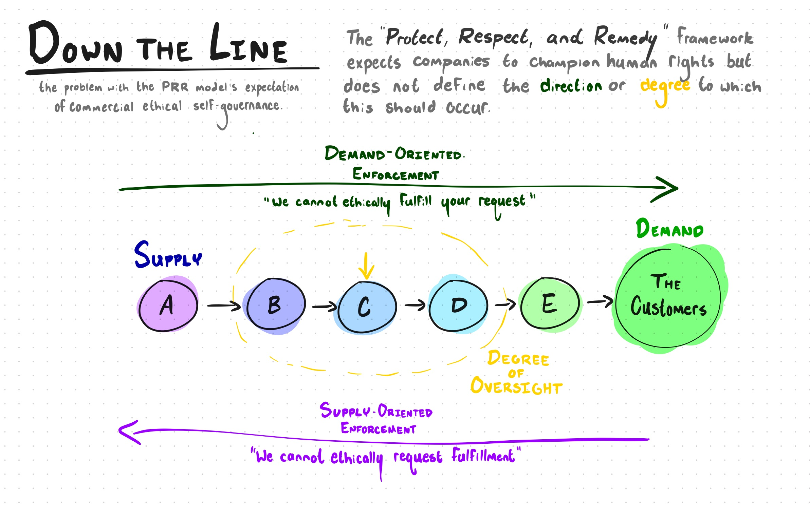

# The Ready-Made Garment Industry: A Bangladeshi Perspective

An analysis of [The Ready-Made Garment Industry: A Bangladeshi Perspective](https://www.hbs.edu/faculty/Pages/item.aspx?num=52483) Harvard Business School case, by Spencer Elkington.

## Balancing Growth Against Ethics (Q1)

Siddique, in his rationale for returning to Bangladesh following his business
education in the United States and United Kingdom, stated:

> My goal was not to be just a leading textile player in Bangladesh, but in
the long run to think about the service I could provide to my country.

Emerging markets are in an interesting position, as they are being developed in
a world that has a far stronger ethical infrastructure than was available during the initial rise of industrialization. These economies are in the position where they must balance growth against the oversight of organizations ready and able to govern commercial practices, such as the United Nations, World Trade Organization, and multinational companies able to vet their supply chains.

Achieving his goal to provide to his country is one in the same to his goal as director of Simco: to ensure his company is able to continue employing its workers and pushing Bangladesh towards a secure, developed economy. Saddique is also tasked, both by his own morality and the demand for ethically sources goods, to do so in a way that doesn't jeopardize human rights. His decision, though, is to determine whether his responsibility stops at his own employees, or extends to the employees of his subcontractors.

## The Chain of Responsibility (Q2)

The actors involved can be split into two categories: **governmental** and **commercial**. This is a given, and is the reason why the "Protect, Respect and Remedy" (PRR) framework assigns different responsibilities to either category.

### Commercial Actors

Under the PRR framework, Tazreen Fashions, Simco, Success Apparel, and Walmart each has the obligation to respect human rights, "acting with due diligence to avoid infringing on the rights of others, and addressing harms that do occur." While this sentiment is wonderful, **the PRR framework does a poor job of defining each commercial actor's actual responsibilities.**

The PRR framework expects companies to respect human rights, but does not define:

- The **degree** of separation up or down the chain that a company should seek to enforce human rights; and
- The **direction**, up or down its' supply chain, towards which a company should seek to enforce human rights.

### The Base Case: Your Own House In Order

The most base case - and one that is indisputable - is that a company should ensure that everything it does *internally* protects the rights of its' direct employees. We can call this **enforcement to the 0th degree**, as the company does not look to monitor rights outside of its' own direct influence.

In a perfect world, base rights enforcement would be satisfactory. In this world, each actor would satisfy the human rights of its' employees and, in turn, trust that every actor before and after them in the supply chain is doing the same.

In an imperfect world (i.e. the *real* world), the base case becomes unsatisfactory. If some actor in the supply chain chooses to violate the human rights of its' employees, these violations are unseen by the unaware neighboring companies, and the violations are irremediable. In this environment, PRR is guaranteed to fail. It follows, then, that a more complicated case is necessary.

### The Necessary Case: Thy Subcontractor's Keeper

The following case is that each company must not only observe human rights themselves, but *also* monitor its' supply chain neighbors in order for the PRR framework to have a chance of success. This complicates the issue, because the knowledge that companies must look past their own practices and into the practices of others does nothing to answer the question of *how far* past themselves they ought to look.

Returning to a near-perfect world, companies would have a perfect knowledge of their entire supply and exactly how ethically each neighbor is sourcing their goods. In this perfect world, knowledge is broad and free.

In the real world, though, knowledge comes at a price. The perceived violations Simco observes in their subcontractor, Tazreen Fashions, is done so at the **third degree** - issues were found at the facility of a *subsidiary* of the **parent company** of a *subcontracted supplier*, resulting in three degrees of separation between Simco and the observed violations. The violation was, to some degree, found by accident.

Should Simco be expected to thoroughly investigate *every* third-degree neighbor of their supply chain? The small business, pressed for time by contractual deadlines, likely wouldn't have the resources to dig very deep. **It is unrealistic to expect all actors to have the resources to look very deep into their neighboring companies**, and knowledge of the full chain is unrealistic.

### Barking Up and Talking Down

The necessity of a higher degree of investigation brings with it a new degree of freedom - investigating *up* the supply chain rather than *down.* If the demand for a product is significant enough, as it was for Simco's product, finding the necessary supply to satisfy that demand means employing more supply neighbors, and potentially colliding into more rights violations. At some point, **demand may become ethically unsatisfiable.**

Each actor in the supply chain has the power to decide not only their *suppliers*, but also their *customers*. A choice not to work with a company who sources unethical supply and a choice not to work with a company who provides unethical demand are two sides of the same coin. However, because satisfying demand is how a company generates revenue, the decision to turn down a customer is practically more difficult. In a profit-maximizing ultimatum between taking unethical supply and turning down an unethical demand, turning down demand would be a difficult choice to make.

The pressure placed on Simco to hit production metrics is a major point of pressure in this case. With contracts signed and deadlines passed, the demand placed on Simco requires the use of subcontracting - their customer even stated as such. This places Simco in the uncomfortable position of either using ethically dicey subcontractors or admitting that the contract isn't ethically fulfill-able and taking a potentially fatal financial hit in the process.